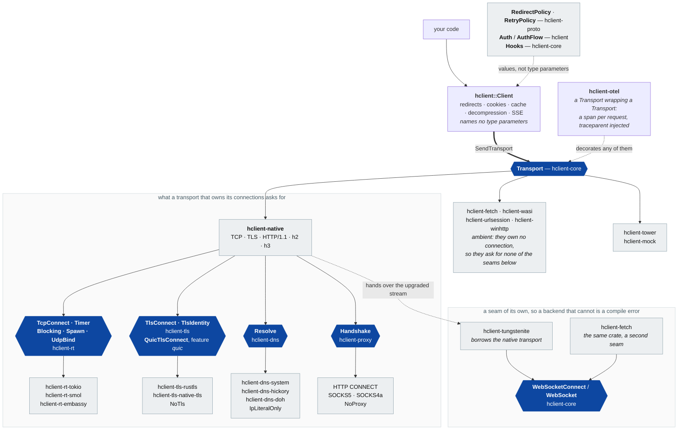

# hclient

**An HTTP client complete enough to build a new curl on — or a browser.**

`cargo add hclient --features default-transport`, and the four lines below
compile as written. The flag is deliberate — see the crate's README for why
a default would be a floor rather than a default.

Those two want opposite things. A command-line tool wants a static binary
with no runtime, honest exit codes and no surprises. A browser engine wants
streaming bodies, connection reuse, protocol negotiation, cancellation that
actually cancels. A client that serves one ends up wrong for the other.

Most HTTP clients are shaped by the first thing they were used for. This one
is shaped by refusing to choose. The same application code runs on a native
socket, on `wasi:http`, on the browser's own `fetch` and on Apple's
`URLSession` — and no backend is allowed to claim a capability it does not
have. That last clause is enforced rather than asked for: a setting a
backend cannot honour is an error at `build()`, not a value quietly
dropped.

It is a kit, not a monolith. The transport, the TLS stack, the resolver and
the async runtime are each a seam with more than one part behind it: rustls
or the platform's own TLS, the system resolver or hickory, tokio or smol.
Take the pieces you need. A build with no room for TLS or a resolver takes
neither, and still makes requests.

HTTP/1.1, HTTP/2 and HTTP/3 are all spoken; connections are pooled and h2
can be multiplexed on request; request and response bodies stream, with
real full duplex on h3. WebSocket and WebTransport are their own crates,
behind their own seams, because a transport that cannot do them should be
a compile error rather than a runtime refusal. Cookies, an RFC 9111 cache,
redirects, decompression, proxies (HTTP `CONNECT` and SOCKS5) and
`multipart/form-data` are each one implementation shared by every backend,
which is what makes "the same answers everywhere" more than a slogan.

**`hclient::Client` names no type parameters**, so a library that takes a
client writes `fn f(c: &Client)` and nothing else — no transport, no clock,
no `where` clause pushed to its own callers. It is `Clone` with `Arc`
semantics and `Send + Sync`. The price is written down where it lands: a
response body cannot cross a `tokio::spawn`, because one body type has to
serve the browser backend too, and a caller who needs the concrete backend
asks for it with `Client::transport_as::<T>()`.

**Published as a pre-release on purpose.** Six public types took a
breaking change in the month before the first one, so the seams are young
rather than settled — and a pre-release says that in the one place
everyone looks.

**What that does and does not do is worth stating exactly, because the
obvious version of it is wrong.** `cargo add hclient` **does** select a
pre-release today — measured — because there is no stable release for it
to prefer; the moment `0.1.0` exists, `cargo add` takes that instead and
nobody reaches a pre-release without asking. So the guard is real and it
starts working at the first stable release, not now. What is true now is
that the version is visible in `Cargo.toml` the moment it is added.

```
cargo add hclient --features default-transport
```

Add `default-http2` and `default-http3` to that list for HTTP/2 and
HTTP/3; `Client::new()` and everything after it is unchanged, and the
client then routes by the origin's HTTPS record the way a browser does.

`0.1.0` follows when the seams stop moving. `AGENTS.md` says what that
promise will cost.

## The seams, as a picture

Every arrow below is a **trait**, and every one has more than one thing
behind it — which is what makes it a seam rather than a layer. Nothing
here is a plugin registry: each is an ordinary Rust trait with an
associated type or two, chosen at compile time.



**Three things the picture is claiming.** The bottom four seams are asked
for by `hclient-native` and by nothing else — an ambient backend has no
socket, no clock and no resolver of its own, which is why swapping in
`hclient-fetch` costs one line and no `where` clause. `WebSocketConnect`
is deliberately *not* a method on `Transport`: a backend that cannot do it
is then a compile error rather than a runtime refusal, and the browser —
where `WebSocket` is a separate global a `fetch`-shaped transport cannot
reach — is the case that proves the shape. And the arrow into `Client`
carries **values**, not type parameters: a policy, a jar, a hook are all
things you hand over, so two clients differing only in their redirect
rule are the same type — which is what lets a library write
`fn f(c: &Client)` and nothing else.

## The twenty-five published crates, as six families

You name **one**: `hclient`. Most of the rest reach your lockfile
transitively, and about a dozen are ever chosen deliberately — the
remainder is plumbing. What follows is
so the list reads as families rather than as thirty rows. On crates.io the
same grouping is the keyword `hclient`, plus `transport`, `runtime`, `tls`
or `dns` on the family members.

**The client**

| crate | what it is |
|---|---|
| `hclient` | the facade: one `Client`, redirects, cookies, cache, decompression, SSE |
| `hclient-core` | the plugin contract — `Transport`, `Capabilities`, `RequestBody`, `Error`, `Timer` |
| `hclient-proto` | pure state machines: no I/O, no async, no runtime |
| `hclient-mock` | a mock transport and a controllable clock, for testing against the seam |

**Transports** — a client sends requests over exactly one of these

| crate | what it is |
|---|---|
| `hclient-native` | TCP + TLS + HTTP/1.1, HTTP/2 and HTTP/3 behind features, choosing by the origin's HTTPS record. `hclient_native::H3` is the QUIC stack alone, for a build that wants no TCP beside it |
| `hclient-fetch` | the browser's own `fetch` |
| `hclient-wasi` | `wasi:http` 0.3 |
| `hclient-urlsession` | Apple's `URLSession` |
| `hclient-tower` | any `tower::Service`, so `tower-http` middleware applies |
| `hclient-winhttp` | Windows' own WinHTTP |
| `hclient-otel` | not a transport of its own but a **decorator** over one: a span per request, `traceparent` and `baggage` injected |

**Runtimes** — what the native transport does I/O and time with

| crate | what it is |
|---|---|
| `hclient-rt` | the seam: `TcpConnect`, `Timer`, `Blocking`, `Spawn`, `UdpBind` |
| `hclient-rt-tokio` · `hclient-rt-smol` | the two general-purpose ones |
| `hclient-rt-embassy` | `embassy-net` and `embassy-time`, which is what makes embedded reachable |

**TLS**

| crate | what it is |
|---|---|
| `hclient-tls` | the seam, plus `NoTls` for a build with no room for a stack; the QUIC seam behind a `quic` feature |
| `hclient-tls-rustls` | the default: memory-safe, same behaviour everywhere |
| `hclient-tls-native-tls` | the platform's own stack, for OS-held trust decisions |

**Resolvers**

| crate | what it is |
|---|---|
| `hclient-dns` | the seam, plus `IpLiteralOnly` for a build with no resolver |
| `hclient-dns-system` | `getaddrinfo`, through the `Blocking` capability |
| `hclient-dns-hickory` | the one that can actually answer SVCB |
| `hclient-dns-doh` | DNS-over-HTTPS, over any transport |

**On top of a connection**

| crate | what it is |
|---|---|
| `hclient-tungstenite` | WebSocket framing over an upgraded byte stream |
| `hclient-webtransport` | WebTransport sessions over an HTTP/3 connection |
| `hclient-proxy` | HTTP `CONNECT`, SOCKS5 and SOCKS4a as sans-io handshakes, and the machine's own proxy settings |
| `hclient-idn` | UTS 46 through the platform's own ICU where there is one |

**And a binary**

| crate | what it is |
|---|---|
| `hclient-cli` | `hc`: httpie's request grammar, curl's `--insecure` and `--resolve`, and `--backend` chosen at **run time** — refused by name when the build has not got it |

Three more live in the repository and are deliberately not published:
`hclient-rt-embassy`, whose one real deployment is this repository's own
CI; `hclient-rt-nal`, which is blocked on `no_std`; and
`hclient-rt-pair-check`, a test harness that must depend on two runtimes
at once, which no shipped crate may do. Each says so in its own manifest.

Each crate's own README says the thing that decides its existence: **why it
is a separate crate.** The short version is one rule — a crate exists to
hold a dependency that a feature would otherwise spread to every graph in
the workspace, because Cargo unifies features and a graph cannot opt out of
one somebody else switched on.

- [`AGENTS.md`](AGENTS.md) — how it is built, and why each piece is there.
  Long, and the length is the point: every seam records the argument that
  produced it and the measurement that settled it.
- [`docs/competitive-gaps.md`](docs/competitive-gaps.md) — what `reqwest`
  and `ureq` do that this does not, what it does that they cannot, and
  which of the differences are deliberate.
- [`docs/porting-wasi-fetch.md`](docs/porting-wasi-fetch.md) — a real
  consumer ported from another library, line for line: what the port keeps,
  what it fixes, and the four things it changes.
- [`docs/publishing.md`](docs/publishing.md) — how a release is cut, and
  what bites on the first one.
